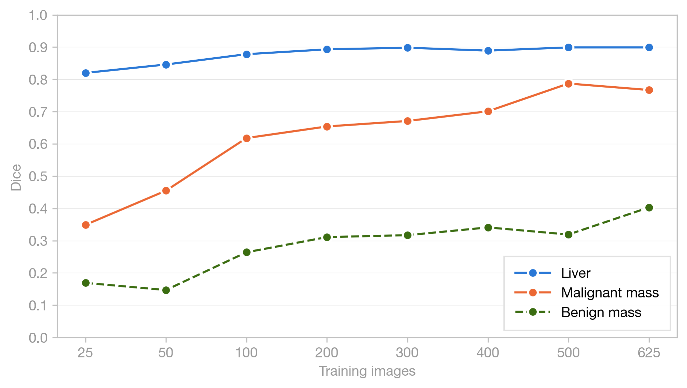

# Liver ultrasound segmentation baselines

> **Status:** Pre-publication. Paper under review, results and weights are final but documentation may change.

Resource efficiency baselines for liver and mass segmentation on B-mode ultrasound using nnU-Net. Trains at eight nested subset sizes (25 to 625 images) on the [AUL dataset](https://zenodo.org/records/7272660) and evaluates each model against a fixed 110-image test set.

**Paper:** [Resource efficiency of nnU-Net for malignant liver mass segmentation on B-mode ultrasound](paper/) (Price-Gauger, 2026)

**Model weights:** [huggingface.co/rhpg/liver-us-nnunet-baselines](https://huggingface.co/rhpg/liver-us-nnunet-baselines) (10 checkpoints, Apache 2.0)

## Key results

| Metric | 200 images | 625 images |
|--------|-----------|-----------|
| Liver Dice | 0.893 | 0.899 |
| Malignant mass Dice | 0.654 | 0.767 |
| Benign mass Dice | 0.311 | 0.403 |
| Malignant detection rate | -- | 97% |
| Benign detection rate | -- | 70% |

Liver segmentation is effectively solved at 200 images. Malignant mass detection reaches clinically usable levels and continues improving. Benign mass detection remains poor across all sizes, driven primarily by smaller lesion size. See the paper for per-class analysis, size-class interactions, intensity contrast analysis, projected performance, and ablation experiments.



## Repository structure

```
paper/                  LaTeX source, figures, and generation scripts
training/               Training pipeline
  convert_aul.py          Convert AUL to nnU-Net format with outline masking
  create_subsets.py        Generate nested stratified subsets
  custom_trainers/         nnUNetTrainer150, nnUNetTrainer300
  run_efficiency_study.sh  Train all subset sizes
  run_ablations.sh         Epoch and architecture ablation experiments
analysis/               Post-training evaluation
  evaluate.py              Dice evaluation
  evaluate_efficiency.py   Efficiency curve across all sizes
  evaluate_by_class.py     Mass Dice by benign vs malignant
  dice_vs_size.py          Mass Dice vs lesion size with correlation
  dice_by_class_and_size.py  Size-class interaction by quartile
  intensity_contrast.py    Echogenicity analysis
  mass_liver_ratio.py      Mass-to-liver size ratio
  extrapolate.py           Log-curve performance projections
  visualize_all_predictions.py  Prediction overlays for all test cases
research/               Novelty claim validation (search scripts and results)
utilities/              Cloud GPU provisioning and download scripts
data/                   Raw AUL dataset (from Zenodo, not tracked)
results/                Training outputs and prediction visualizations
```

## Reproduction

Requires Python 3.10+ and a CUDA GPU for training. The full efficiency study (8 runs, 150 epochs each) completes in ~8 hours on an A100 80GB for approximately $14 in compute. Evaluation runs locally on CPU.

```bash
pip install -r requirements.txt

export nnUNet_raw="/path/to/nnUNet_raw"
export nnUNet_preprocessed="/path/to/nnUNet_preprocessed"
export nnUNet_results="/path/to/nnUNet_results"
```

### 1. Download and convert data

```bash
# Download AUL from Zenodo into data/
python training/convert_aul.py \
  --raw-data-dir data/AUL \
  --output-dir $nnUNet_raw/Dataset001_LiverUS
```

### 2. Create subsets and train

```bash
python training/create_subsets.py \
  --source-dir $nnUNet_raw/Dataset001_LiverUS \
  --output-base $nnUNet_raw

bash training/run_efficiency_study.sh
```

### 3. Evaluate

```bash
python analysis/evaluate_efficiency.py \
  --predictions-base $nnUNet_results \
  --labels-dir $nnUNet_raw/Dataset001_LiverUS/labelsTs

python analysis/evaluate_by_class.py
python analysis/dice_vs_size.py
```

Step-by-step provisioning instructions for Verda Cloud are in [utilities/setup-instructions.md](utilities/setup-instructions.md).

## References

- Alsharid et al. (2025). On the public dissemination and open sourcing of ultrasound resources, datasets and deep learning models. npj Digit. Med. 8, 777.
- Isensee et al. (2021). nnU-Net: a self-configuring method for deep learning-based biomedical image segmentation. Nature Methods, 18(2), 203-211.
- Xu et al. (2022). Annotated Ultrasound Liver images dataset. Zenodo. https://zenodo.org/records/7272660

## License

Apache 2.0
